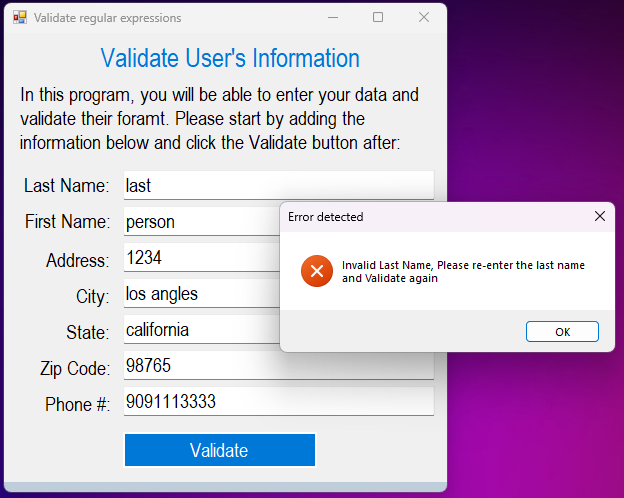

# Validate Regular Expressions Application

This application was made to validate a user input using the regular expressions class.

The main window form of the application: 

The final window form of the application: 

